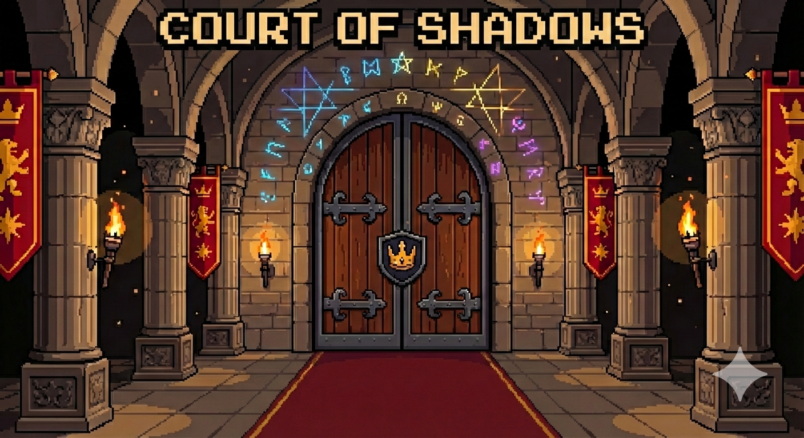

<div align="center">
  
  
  # Court of Shadows 👑🌑
  **A Zero-Knowledge Multiplayer Strategy Game on the Stellar Network**

  [](https://stellar.org/)
  [](https://noir-lang.org/)
  [](https://reactjs.org/)
  [](https://fastify.dev/)

  [Play the Game](#quick-start) • [Read the Rules](#game-mechanics) • [Technical Architecture](#technical-architecture) • [Zero-Knowledge Implementation](#zero-knowledge-integration)
</div>

---

## 📖 Executive Summary

**Court of Shadows** is a multiplayer card game of deception, deduction, and hidden influence, built from the ground up for the Stellar ecosystem. In a digital tabletop environment, players deploy nobles face-down, declaring their intentions to either act truthfully or bluff their way to power. 

Traditional digital card games rely entirely on trusted centralized servers to manage hidden states (like hands or face-down cards). **Court of Shadows disrupts this model by introducing Zero-Knowledge (ZK) proofs via Noir and Soroban.** When a player makes a critical move that requires proving a hidden card's identity (e.g., the Knight effect), the game uses ZK circuits to mathematically prove the action is valid—without ever revealing the card to the opponent or the server.

This project was built for the **Stellar Hacks: ZK Gaming Hackathon**, showcasing how decentralized cryptography can enhance player trust, enable verifiable bluffing mechanics, and create a seamless, premium gaming experience on Stellar.

---

## 🎮 Game Mechanics

The objective is simple: reduce your opponent's **Influence** from 3 to 0. 
Each turn is a high-stakes psychological duel.

### The Turn Phase
1. **Draw:** Pull a card from the deck.
2. **Play Face-Down:** Place a card into an active slot or from your hand, keeping it hidden.
3. **Declare:** Announce the card you just played. You can tell the truth or **bluff**.
4. **Response Window:** Your opponent has three choices:
   - **Accept:** The effect resolves normally.
   - **Counter:** The effect is canceled, and the card is discarded.
   - **Challenge:** The ultimate call-out. If the attacker lied, they lose 1 Influence and the card is discarded. If the attacker told the truth, the *challenger* loses 1 Influence, and the effect resolves.

### The Nobles (Card Classes)
| Class | Rank | Effect |
| :--- | :---: | :--- |
| **Knight** | 1 | Guess the identity of a face-down enemy card. If correct, opponent loses 1 Influence. *(Powered by ZK Proofs)* |
| **Herald** | 2 | Marks an opponent's slot. |
| **Baron** | 3 | Initiates a Rank Duel against an opponent's slot. The higher rank wins; the loser loses 1 Influence. |
| **Bishop** | 4 | Grants **Ward** (immunity to the next targeted effect). |
| **Countess**| 5 | Forces the opponent to discard a random card from their hand. |
| **Duke** | 6 | Gain 1 Influence. *(Great for bluffing!)* |
| **Assassin**| 7 | Instantly destroys an opponent's slot card without a duel. |
| **King** | 8 | Opponent loses 2 Influence. If both players hold the King, the game ends in an exposed tie. |

---

## 🔬 Zero-Knowledge Integration

The core innovation of Court of Shadows is its use of Zero-Knowledge proofs to handle hidden information, specifically during the **Knight's** guessing mechanic.

When a card is placed face-down, its state must remain hidden from both the opponent and potential server-side observers. However, if the opponent uses a Knight to "guess" the card, the game must definitively prove whether the guess is correct without revealing the card if the guess is wrong.

### The Cryptographic Flow:
1. **Commitment:** When a card is dealt/placed, a `Pedersen Hash` commitment is generated using the `card_class` and a secret `salt`. This commitment is public.
2. **The Guess:** The attacker declares: *"I use my Knight to guess your Left Slot is an Assassin."*
3. **The Proof:** The defender's client generates a Noir ZK proof. The circuit takes the private `card_class` and `salt`, the public `declared_guess`, and the public `commitment`. 
   - The circuit verifies: `hash(card_class, salt) == commitment`
   - The circuit evaluates and outputs: `card_class == declared_guess`
4. **On-Chain Verification:** The generated `UltraHonk (Barretenberg)` proof is sent to the **Soroban Smart Contract** (`CrownShadowsVerifier`). The contract verifies the proof and emits an event confirming whether the guess was correct, maintaining perfect cryptographic integrity.

---

## � Hackathon Requirements Checklist

To explicitly satisfy the **Stellar Hacks: ZK Gaming** requirements, Court of Shadows implements the following:

### 1️⃣ A ZK-Powered Core Mechanic
**ZK is not just a secondary feature; it is the engine of the game's core deduction mechanic.** 
When a player uses the **Knight** card to guess an opponent's hidden card, the attacking client does not request the answer from a trusted server, nor does the defending client transmit their card's identity in plaintext. Instead, the defending client executes a **Noir ZK Circuit** locally. 

This circuit computationally verifies whether the hidden card matches the attacker's guess against a **public Pedersen commitment** made earlier in the game. The truth is proven cryptographically on-chain without ever revealing the card to anyone if the guess was wrong. This preserves the "fog of war" essential to the deception genre natively on Web3.

### 2️⃣ A Deployed On-chain Component (Stellar Testnet)
The game relies on a custom [Soroban Smart Contract](https://stellar.org/soroban) deployed on the Stellar Testnet. This contract has two primary responsibilities:
1. **Verifying Aztec Barretenberg Proofs:** It acts as the ultimate cryptographic arbiter, evaluating the ZK proofs submitted by players during a Knight's action.
2. **Game Hub Integration:** Our smart contract natively interacts with the official Hackathon Game Hub Contract (`CB4VZAT2U3UC6XFK3N23SKRF2NDCMP3QHJYMCHHFMZO7MRQO6DQ2EMYG`). 
   - When a match is created in the lobby, our Soroban contract triggers `start_game()` on the Hub via cross-contract calls.
   - When a player's Influence reaches zero (or a King tie occurs), our contract triggers `end_game()` on the Hub to finalize the immutable on-chain record of the match.

---

## �🏗 Technical Architecture

The project is structured as a full-stack monorepo, separating the blockchain logic, the authoritative game server, and the premium React frontend.

```text
court-of-shadows/
├── blockchain/          # ZK Circuits & Web3 Infrastructure
│   ├── circuits/        # Noir language circuits (main.nr)
│   ├── contracts/       # Soroban Rust Contracts for on-chain verification
│   └── scripts/         # Shell scripts for building, proving, and deploying
├── back/                # Authoritative Game Server
│   ├── src/             # Fastify, Socket.IO, TypeScript game state engine
│   └── package.json     
└── front/               # Premium User Interface
    ├── src/             # Vite, React, Zustand, UI Components
    └── public/          # Game Assets, Audio, and Card Artwork
```

### Tech Stack
* **Frontend:** React, Vite, Vanilla CSS (Custom Design System), Zustand (State), React Router, Socket.IO Client.
* **Backend:** Node.js, TypeScript, Fastify, Socket.IO.
* **Wallet Context:** `StellarWalletsKit` for seamless Freighter integration & Testnet Horizon API for account funding/balance checks.
* **ZK Circuit:** Noir (`nargo` v0.32.0).
* **Proving Backend:** Aztec Barretenberg (`bb` UltraHonk).
* **Smart Contracts:** Rust (`wasm32-unknown-unknown`), compiled for Stellar Soroban.

---

## 🚀 Quick Start & Deployment Guide

Follow these steps to run the complete Court of Shadows stack locally.

### Prerequisites
* Node.js ≥ 20
* Rust + `wasm32-unknown-unknown` target
* [Stellar CLI](https://developers.stellar.org/docs/tools/developer-tools/cli/install-cli)
* [Nargo (Noir Compiler)](https://noir-lang.org/docs/getting_started/installation/)
* [bb (Barretenberg Prover)](https://github.com/AztecProtocol/aztec-packages/releases)

### 1. Launch the Backend Game Server
```bash
cd back
npm install
npm run dev
# Server runs on http://localhost:3001
```

### 2. Launch the Frontend UI
```bash
cd front
npm install
npm run dev
# App runs on http://localhost:5173
```

### 3. ZK Proofs & Smart Contracts
To test the Zero-Knowledge infrastructure, navigate to the `blockchain` directory.

**Compile Noir Circuit & Generate VK:**
```bash
chmod +x scripts/build_zk.sh
./scripts/build_zk.sh
```

**Deploy the Soroban Verifier Contract:**
*(Ensure your Stellar CLI is configured for Testnet and funded)*
```bash
chmod +x scripts/deploy.sh
./scripts/deploy.sh
```

**Verify a Proof On-Chain:**
```bash
chmod +x scripts/verify_on_chain.sh
./scripts/verify_on_chain.sh
```

---

## 🎨 Design Philosophy

A major focus during the hackathon was proving that Web3 games do not have to compromise on UX/UI. Court of Shadows employs a **premium, dark-fantasy aesthetic** utilizing:
* Hand-crafted CSS animations (spring physics, layout transitions).
* Responsive, mobile-first flexbox layouts.
* A dedicated original soundtrack module that enhances immersion.
* Persistent wallet sessions (localStorage hydration) to prevent frustrating disconnects upon page reloads.

---

## 🔮 Future Roadmap
1. **Full On-Chain State:** Moving from an authoritative Web2 server to a fully decentralized state channel on Soroban.
2. **Matchmaking:** Implementing a robust ELO-based matchmaking system.
3. **Card Expansion:** Introducing new noble classes with complex ZK-dependent abilities.
4. **Tournaments:** Smart contract-escrowed tournaments where players stake XLM to enter.

---
*Built for the Stellar Hacks: ZK Gaming Hackathon - 2026*
